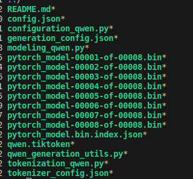

### 总述
本工作是 [NVIDIA TensorRT Hackathon 2023](https://github.com/NVIDIA/trt-samples-for-hackathon-cn/tree/master/Hackathon2023) 的参赛题目
- 本次具体选题是：2   
- 新模型：Qwen-7B-Chat　
- 模型链接：https://github.com/QwenLM/Qwen-7B/blob/main/cli_demo.py#L39
- 模型介绍：<br>
通义千问-7B（Qwen-7B） 是阿里云研发的通义千问大模型系列的70亿参数规模的模型。Qwen-7B是基于Transformer的大语言模型, 在超大规模的预训练数据上进行训练得到。预训练数据类型多样，覆盖广泛，包括大量网络文本、专业书籍、代码等。同时，在Qwen-7B的基础上，我们使用对齐机制打造了基于大语言模型的AI助手Qwen-7B-Chat。
- 优化效果：<br>
  经过生成引擎后，与原始模型针对输入：续写：RTX4090具有760亿个晶体管，16384个CUDA核心，做推理速度对比;
  以5次推理平均每个生成字符时间为基准，进行对比，效果如下：<br>

  | 推理方式 | 平均耗时(单个字符生成) |总耗时 |rouge |
  | :------| ------: | :------: | :------: |
  | Qwen-7B(原始模型)  | 0.03153 | 13.8568|
  | Qwen-7B(TensorRT-LLM)  | 0.01813 | 6.9631 |
　&nbsp; 以上效果可见,加速推理在float16精度快了近１倍速度;<br>
 &nbsp; &nbsp;&nbsp;针对summmary摘要性能以及rouge分数评测结果如下：<br>

  | 推理方式 |总耗时 |rouge1 |rouge2|rougeL|rougeLsum|
  | :------| ------: | :------: | :------: |:------: |:------: |
| Qwen-7B(原始模型HF)| 74.0851 | 25.8615|8.8051|18.0820|22.1695|
| Qwen-7B(TensorRT-LLM)  | 46.6413 | 27.9374 |8.6715|19.3419|23.4794|

- Docker环境代码编译、运行步骤说明：<br>
  - 步骤1:容器启动：<br>
  &nbsp; nvidia-docker run -it --name trt_2023 registry.cn-hangzhou.aliyuncs.com/trt-hackathon/trt-hackathon:final_v1 /bin/bash<br>
  - 步骤2: clone 本人的项目到容器路径/root/workspace下<br>
  &nbsp; git clone https://gitee.com/chenmingwei53/trt2023_qwen7-b.git<br>
  &nbsp; 用户名：chenmingwei53<br>
  &nbsp; 密码：chentian184616(比赛结束后，密码更改)<br> 
   - 步骤3:依赖安装<br>
   　安装lfs:<br>
　　　 curl -s https://packagecloud.io/instal:l/repositories/github/git-lfs/script.deb.sh | bash<br>
&nbsp; &nbsp;&nbsp; 　apt-get install git-lfs<br>
 &nbsp; &nbsp; 　    pip install tiktoken -i https://pypi.tuna.tsinghua.edu.cn/simple<br>
  &nbsp; &nbsp; 　        pip install onnx_graphsurgeon -i https://pypi.tuna.tsinghua.edu.cn/simple
   - 步骤4:依赖模型下载<br>
   　模型下载到容器路径：/root/workspace/<br>
   　链接:https://huggingface.co/Qwen/Qwen-7B-Chat<br>
     a.网络通顺的情况下：<br>
     　git lfs install<br>
  &nbsp; &nbsp; git clone https://huggingface.co/Qwen/Qwen-7B-Chat<br>
     b.用户网络通顺，但服务器网络不好：<br>
     　手动下载链接https://huggingface.co/Qwen/Qwen-7B-Chat所有文件到/root/workspace/QWen-7B-Chat文件夹内,具体文件如下图内容：<br>
     &nbsp; &nbsp;          
     c.用户网络只能访问百度：<br>
 &nbsp;大佬提供网盘链接：https://pan.baidu.com/s/14XxZ-JO5RfhGJEVs_BEiDA?pwd=8rw4#list/path=%2F<br>
   &nbsp;下载文件到Qwen-7B-Chat,注意！！！文件路径必须与b保持一致．
   -  步骤5:运行前的准备工作,运行：<br>
  sh ./trt2023_qwen7-b/tensorrt_llm_july-release-v1/qwenb_chen/prepare.sh <br>
    - 步骤6:  导出lm_head的模型参数　　　<br>
    cd /root/workspace/tensorrt_llm_july-release-v1/qwenb_chen　<br>
    python exportLM.py
    - 步骤7:  torch模型文件转化为FT模型文件<br>
    cd /root/workspace/tensorrt_llm_july-release-v1/qwenb_chen　<br>
    python hf_qwen7b_convert.py
    - 步骤8:  运行build.py文件，生成qwen7b推理引擎文件,默认构建float 16,使用gpt-attention<br>
    cd /root/workspace/tensorrt_llm_july-release-v1/qwenb_chen　<br>
    python3 build.py --model_dir=./qwenftModel/1-gpu \
                 --dtype float16 \
                 --use_gpt_attention_plugin float16
    - 步骤9:  运行run.py文件，生成对应的回复内容:<br>
    cd /root/workspace/tensorrt_llm_july-release-v1/qwenb_chen<br>
    python run.py --input_text=续写：RTX4090具有760亿个晶体管，16384个CUDA核心
                  --engine_dir=./qwen_trtModel
                  --tokenizer_dir=/root/workspace/QWen-7B-Chat
    - 步骤10:  运行summarize.py文件，生成摘要评测指标:<br>
     cd /root/workspace/tensorrt_llm_july-release-v1/qwenb_chen<br>
     python summarize.py --test_hf=True --test_trt_llm=False<br>
     python summarize.py --test_hf=False --test_trt_llm=True
### 主要开发工作
#### 开发工作的难点 
 
- 本次使用了 TensorRT-LLM对新模型qwen7b模型进行模型推理加速，该模型从结构上来看，参考chat-glm6B 
   并无太大差别，整体结构仍然基于基础架构transformer+lm_head;使用了RotaryEmbedding,与chat-glm6b
   主要区别在于使用的层输出-norm不同以及旋转矩阵的详细操作不同，具体的如下(以下操作均为普通attention,没有使用flash attention)<br>
  - 模型与chat-glm6b不同之处：<br>
   chat-glm6b:　layernorm<br>
   qwen7b:    RMSNorm<br>
   旋转矩阵：
   ````# 显示需要加 # ，Markdown中不需要加
   chat-glm6b:
    # add weight of position embedding
    nMaxSL = 2048
    inv_freq = 10**(-1 / 16 * np.arange(0, 64, 2, dtype=np.float32))
    valueTable = np.matmul(
        np.arange(nMaxSL, dtype=np.float32).reshape(-1, 1),
        np.concatenate([inv_freq, inv_freq],
                       axis=0).reshape(1, -1)).reshape(nMaxSL,
                                                       len(inv_freq) * 2)
    np.cos(valueTable).astype(storage_type).tofile(saved_dir /
                                                   "model.cosTable.weight.bin")
    np.sin(valueTable).astype(storage_type).tofile(saved_dir /
                                                   "model.sinTable.weight.bin")
    print("Save model.cosTable.weight.bin")
    print("Save model.sinTable.weight.bin")
  ##################################################################################
  qwen7b:
    nMaxSL = 8192
    base=10000.0
    inv_freq = 1.0 / (base ** (np.arange(0, 128, 2,dtype=np.float32) / 128))
    # inv_freq = 10**(-1 / 16 * np.arange(0, 64, 2, dtype=np.float32))
    valueTable = np.matmul(
        np.arange(nMaxSL, dtype=np.float32).reshape(-1, 1),
        np.concatenate([inv_freq, inv_freq],
                       axis=0).reshape(1, -1)).reshape(nMaxSL,
                                                       len(inv_freq) * 2)  # shape is [2048,64] the relate is for postions
    # valueTable=rearrange(valueTable, "n d -> 1 n 1 d")
    cos= np.cos(valueTable) #[:,:64]
    cos=cos.astype(storage_type).tofile(saved_dir /
                                                   "model.cosTable.weight.bin")
    
    sin= np.sin(valueTable)#[:,:64]

    sin=sin.astype(storage_type).tofile(saved_dir /
                                               "model.sinTable.weight.bin")
    print("Save model.cosTable.weight.bin")
    print("Save model.sinTable.weight.bin")
  ````
  以上对比可以发现使用的base基数以及频率域范围不同，chat-glm使用64,qwen7b使用的128这一点复现非常重要;
  直接影响了每个位置对应的embedding数值．主要区别在于inv_freq数值不同,
  导致输入postion_ids不同.<br>
  为了复现方便，qwen7b仿照chatglm6b在prepare_input函数保持一致
  ````
   position_ids = Tensor(name='position_ids',
                              dtype=trt.int32,
                              shape=[-1,2,-1],
                              dim_range=OrderedDict([
                                  ('batch_size', [bb_range]),
                                  ('2', [2]),
                                  ('input_len', [inlen_range]),
                              ]))
  ````
  但实际的输入发生了本质的变化，
   ````
  代码所在位置：tensorrt_llm/runtime/generation.py-->_prepare_context_inputs函数
  chat-glm6b:
    position_ids = torch.zeros([batch_size, 2, max_input_length],
                                   dtype=torch.int32)
    position_ids[:, 0, :] = torch.arange(max_input_length)
    for i in range(batch_size):
        position_ids[i, 0, max_input_length - 1] = max_input_length - 2
        position_ids[i, 1, max_input_length - 1] = 1
        position_ids[i, :, input_lengths[i]:] = 0
  －－－－－－－－－－－－－－－－－－－－－－－－－－－－－－－－－－－－－－－－
  qwen7b:
    position_ids = torch.zeros([batch_size, 2, max_input_length],
                                   dtype=torch.int32)
    position_ids[:, 0, :] = torch.arange(max_input_length)
    position_ids[:, 1, :] = torch.arange(max_input_length)
   ````
  主要是旋转矩阵使用方式不同，具体的：
    ````
  　chat-glm6b position_ids 第二个是生成位置为１，其余为0的矩阵输入，对应函数：
   　def rotate_embedding(x, position_embedding_value):
        cos0, cos1, sin0, sin1 = position_embedding_value

        x128 = x
        x64_part0, x64_part1 = x128.split(64, dim=-1)

        x64_part0_rotate = rotate(x64_part0)
        y64_part0 = x64_part0 * cos0 + x64_part0_rotate * sin0

        x64_part1_rotate = rotate(x64_part1)
        y64_part1 = x64_part1 * cos1 + x64_part1_rotate * sin1

        y128 = concat([y64_part0, y64_part1], dim=3)
        y128 = y128.view(shape(x))
        return y128
   对应的query,key以64分割，分别使用, 与qwen7相同的位置结合操作
    y64_part0 = x64_part0 * cos0 + x64_part0_rotate * sin0
  qwen7b之所这样的position_ids输入，原因在于，在实际调试，并没有对query,key分割操作，
  具体实现如下：
    def rotate_embedding(x, position_embedding_value,position_embedding_value_sin): # the same to qwen7B ApplyRotaryEmb
        t_ = (x * position_embedding_value) + (rotate(x) *position_embedding_value_sin)
        return t_
  　query = rotate_embedding(query,cos0,sin0) #the same to qwen7B
    　key = rotate_embedding(key,cos1,sin1)  #pass
    ````
  　其余的区别都是一些比较细微的区别，例如残差公式不同：<br>
  
         chat-glm6b:
         hidden_states = hidden_states * 7.484375 + attention_output.data
         qwen7b:
         hidden_states = hidden_states + attention_output.data

    - 本次模型主要是用了已有的plugin:gpt_attention;Identity<br>
    - 复现过程中难点：<br>
    　可以说是难点非常多,本身对trt不是非常熟练,trtllm更是首次使用,因此困难点<br>
      1.  刚开始不知道从何下手，通过chat-glm6b对流程有了大概了解，复现起来比较麻烦，
    急需一个比较简单的方式复现，让用户更多时间花在优化精度和效率上，而不是对比原始模型输出上;
       目前本人复现qwen7b主要是逐层对于原模型以及chatglm6b不同之处;<br>
      2. 模型输出与原始模型输出对比没有一个明确的公式或者对应公式阈值作为参考.
        开始：dis=abs(a-b).sum() 其中a,b分别代表优化模型输出以及原始模型输出,发现对比差距非常大，不能作为参考
        听取大佬意见：dis=(a-b).sum(),阈值不能超过1,但是发现在for循环经过最后一个RMSNorm时，差距为
        6.04; 而际最终的词汇预测概率lm_logits并没有受太大影响;经过对比lm_logits与原始
        模型差距仅在千分位，如果保留两位有效数字，那么基本是相同的
        听取老师意见：dis=(a-b).sum()/a.sum(),利用相对误差，基本发现误差在0.0041．<br>
     &nbsp; &nbsp; 综上所述，需要一个基准误差对比才能更好的，更快的复现，否则像我一直在查找RMSNorm经过后
        为什么差距变得这么大，其实主要原因在于RMSNorm，有一个pow(2)的操作; 而这种查找是没有太大意义的.<br>
      3. debug 是非常麻烦，需要修改多个地方，每次打印输出都需要重新build,为此不得不，把所有模型的
      n_layers=1, 这样才能大大降低了build时间
      4. debug 无法直接把输入作为self.register_network_output('input_ids', input_ids)
      　　有时候需要知道在某处输入的实际数值．这样写就会报错，最终不得不：<br>
       ````
        position_ids_1 = position_ids*1
        position_ids_1.mark_output('position_ids1',trt.int32)
        这样的操作
       ````
      e. 有关判断语句十分难写，最终导致我放弃了attention自己实现，由于刚开始对gpt_attention参数没有很好了解，按照
      attention.py去写，由于chat-glm6b的past_key_value不为空，想通过past_key_value_length的变化
      来判断是否为首次生成，但是是不生效的．至今也无法写出类似的判断．<br>
      f. Identity的使用竟然影响输出，按照道理来讲，应该让用户使用不需要考虑，变量地址或者其他影响,让用户更多花在逻辑和优化上，由于基础太差，具体原因大概是变量地址问题？？？
### 开发与优化过程
这一部分是报告的主体。请把自己假定为老师，TensorRT-LLM 的初学者讲述如何从原始模型出发，
经过一系列开发步骤，得到优化后的TensorRT-LLM 模型。
建议： 
- 分步骤讲清楚开发过程
- 最好能介绍为什么需要某个特别步骤，通过这个特别步骤解决了什么问题
  - 比如，通过Nsight Systems绘制timeline做了性能分析，发现attention时间占比高且有优化空间
  （贴图展示分析过程），所以决定要写plugin。然后介绍plugin的设计与实现，并在timeline上显示
  attention这一部分的性能改进。<br>
本次实现的是qwen7b在普通模式情况下attention的TensorRT-LLM在精度float16的加速推理
####1.选择合适的官方大模型熟悉了解TensorRT-LLM优化模型过程
 &nbsp;&nbsp;&nbsp;&nbsp;拿到任务后，首先就是要了解TensorRT-LLM优化大模型的一般过程是什么，由于大部分大模型都是transformer架构，并且存在
非常多的重复算法（学习nlp基本都了解国内翻炒的习惯），并且官方给了llama以及chat-glm6b的实现，选择任意一个去学习利用
TensorRT-LLM优化的一般过程.
 &nbsp;&nbsp;&nbsp;&nbsp;通过学习chatglm后，实现优化主要：<br>
   - a.原始模型参数hf_chatglm6b_convert.py文件转化为FT模型文件．
 说的通俗点就是转化为array类型矩阵，具体为什么，稍后讲解，先说大概流程;<br>
   - b.上一步骤产生的 array类型矩阵主要在这一步build模型来初始化 tensorrt_llm.models.ChatGLM6BHeadModel（）
   　模型的；为此我们知道我们需要实现类似ChatGLM6BHeadModel模型，那么这个是使用TensorRT-LLM的核心，说实话初步使用感觉
   有点像静态图．我们点进去发现实现ChatGLM6BHeadModel类的文件在tensorrt_llm/models/chatglm6b/model.py
   因此实现新的模型需要实现这个核心文件;阅读build.py 文件发现3个关键处，模型初始化，加载模型参数，模型静态图推理．
   利用这三个基本上就能搞定新模型的优化实现．
   -c.作为一个开发人员一定会优先想要了解如何debug,没有debug就很大程度影响开发进度，虽然步骤b静态图可以对逻辑进行修改，
   　有时候具体数值是检验代码是否有bug的关键，通过寻找发现docs/2023-05-19-how-to-debug.md给了gpt的debug方法;
     具体位置在2023-05-19-how-to-debug.md的67行之后．然后结合run.py基本上就了解了整个开发新模型的一般过程．run.py通过阅读
     当然一定要有bert系类生成模型的基础才好阅读，其本质就是解码过程核心在tensorrt_llm/runtime/generation.py
       self.dynamic_decoder = torch.classes.FasterTransformer.DynamicDecodeOp(
            self.vocab_size, self.vocab_size_padded, self.mapping.tp_size,
            pp_size, torch.float32)
       由代码可知具体解码调用的torch，generation主要作用是对数据进行准备，类似ｔｒｔ模型推理的那个过程（）：
       　➢ 创建 Context
        ➢ Buffer 准备（Host 端 + Device 端）
        ➢ Buffer 拷贝 Host to Device
        ➢ 执行推理（Execute）
        ➢ Buffer 拷贝 Device to Host
####２.初步构建qwen7b模型
&nbsp;&nbsp;&nbsp;&nbsp;有了步骤１的学习和分析，可知模型结构基本相似，<br>
➢ a.初步新模型构建
　首先在tensorrt_llm/models/文件夹中创建qwen7B文件库以及__init__.py，model.py文件，优先使用chatglm6b下的文件复制过来,
  并且下载qwen_7b_chat模型文件．对比modeling_qwen.py修改对应model.py的类名，函数名，变量名．这样初步模型构建完成．
  其次在tensorrt_llm/models/的__init__.py文件添加我们实现的模型文件，具体如下：
  ````
...
from .qwen7B.model import Qwen7BHeadModel, Qwen7BModel
__all__ = [
    ...,
    'Qwen7BModel'
]
   ```` 
为了调试方便，把tensorrt_llm所有文件放在自己项目qwenb_chen路径下  
 ➢ b.利用类似静态图模型，同时debug原始模型，进一步对比初始化和推理的区别进行修改;
    由于vscode没怎么用过，不能在transformers安装包内打断点．因此可以把qwen_7b_chat模型文件复制到qwenb_chen路径下：
    QWenLMHeadModel继承QWenPreTrainedModel，存在from_pretrained函数，qwen_7b_chat存在configuration_qwen.py文件
    因此exportLM.py文件代码可以更改为本地导入：
   ````
    from transformers import AutoModelForCausalLM, AutoTokenizer
    from qwen_7b_chat.modeling_qwen import QWenLMHeadModel
    from transformers.generation import GenerationConfig
    from qwen_7b_chat.configuration_qwen import QWenConfig
    import os
    checkpoint_path="/root/workspace/trt2023/QWen-7B-Chat"
    tokenizer = AutoTokenizer.from_pretrained(checkpoint_path, trust_remote_code=True)
    # model = AutoModelForCausalLM.from_pretrained(checkpoint_path, device_map="auto", trust_remote_code=True).eval()
    model = QWenLMHeadModel.from_pretrained(checkpoint_path, device_map="auto", trust_remote_code=True, fp16=True).eval()
    
    model.generation_config = GenerationConfig.from_pretrained(
            checkpoint_path, trust_remote_code=True, resume_download=True,
        )
   ````
 　　复制examples/chatglm6b/build.py到qwenb_chen，修改里边的部分设置，由于大部分设置是相同的，怎么修改设置呢，当然是通过
 　　 我系的build.py和chatglm-6b略微不同，原因是本来想仿照2023-05-19-how-to-debug.md第一个例子去写，后来发现build.py即可完成
 　　自己想要的操作．但所有具体内容还是build.py内容．
     静态图debug,查看原始模型与chat-glm6b之间的区别,由于build.py 文件需要"config.ini"文件，这个文件是hf_qwen7b_convert.py
 　　生成的，因此通过debug方式运行hf_qwen7b_convert.py到80行，即可生成该文件．
 　　由于是for 循环32层，因此我们全部设置１层，即可在２４ｇ显存同时运行两个．在debug时，注释load_from_ft函数即可，
 　　修改n_layer=1 ,原始模型modeling_qwen.py：
        for i, (block, layer_past) in enumerate(zip(self.h, past_key_values)):
            if output_hidden_states:
                all_hidden_states = all_hidden_states + (hidden_states,)
            break #添加break即可实现一层，
    trtllm 模型需要修改：
       build.py
       a.tensorrt_llm_Qwen7BModel = tensorrt_llm.models.Qwen7BHeadModel(
                                                                num_layers=1, #args.n_layer,
 ➢ c.原始模型参数转化为ＦＴ模式
 　　通过modeling_qwen.py 与chatglm-6b对比　lm_logits = self.lm_head(hidden_states)，完全一致，因此按照
 　　chatglm-6b导出lm.npy参数．复制examples/chatglm6b/hf_qwen7b_convert.py到qwenb_chen,
    由于我们基本上使用单gpu,原始的hf_qwen7b_convert.py转化应该考虑到多gpu情况，我们默认使用单gpu进行保存文件即可
    ,因此我们惟一的关注点是要把原始模型参数通过modeling_qwen都保存，而不遗漏，因此保存时，最好罗列出来modeling_qwen
    所有参数名称，layer内的参数只需要１层即可，按照这种方式实际参数名称并不多，而且qwen7b基本上没有使用bias.
     wte.weight
     ln_1.wegiht
     c_attn.wetght
     c_attn.bias 
      c_proj.weight
      mlp.w1.weight
      mlp.w2.weight
      mlp.c_proj.weight
      ln_2.weight
      ln_f.weight
    注意排除
    直到所有模型参数保存完成．这一点非常重要！！！！！
    
    唯一没有说的是旋转矩阵的保存，因为这个我刚开始已经介绍，具体看上面难点介绍，由于我们没有使用flah attention 因此
    原始模型旋转矩阵走的是
    def apply_rotary_pos_emb(t, freqs):
        if apply_rotary_emb_func is not None and t.is_cuda:
            t_ = t.float()
            freqs = freqs.squeeze(0).squeeze(1)
            cos = freqs[:, : freqs.shape[-1] // 2].cos()
            sin = freqs[:, : freqs.shape[-1] // 2].sin()
            output = apply_rotary_emb_func(t_, cos, sin).type_as(t)
            return output
        else:
            rot_dim = freqs.shape[-1]
            t_, t_pass_ = t[..., :rot_dim], t[..., rot_dim:]
            t_ = t_.float()
            t_pass_ = t_pass_.float()
            t_ = (t_ * freqs.cos()) + (_rotate_half(t_) * freqs.sin())
            return torch.cat((t_, t_pass_), dim=-1).type_as(t)
    else下边的代码，通过debug 可知freqs　的shape =[,,128] ,并且初始化获取的postion_ids的embdedding也不同，详细代码请看上边介绍
 ➢ d.细致微调，利用原始模型输出与trtllm生成结果法对比进行修改模型，按照how to debug 文件修改即可budeg
   为了方便调试我们首先设置layer=1，减少build时间 
    build.py
       a.tensorrt_llm_Qwen7BModel = tensorrt_llm.models.Qwen7BHeadModel(
                                                                num_layers=1, #args.n_layer,
       b. load_from_ft  --> 195 line n_layer=1
    run.py 
        a.  num_layers =1# config['builder_config']['num_layers']
    
    经过分析，和经验之谈，最核心的只有两点，其余进行debug输出基本上和原始模型误差不大
    旋转矩阵对齐是关键
    　　按照qwen7b原始生成保存sin,cos的8192,128的向量矩阵
    　　按照qwen7b原始模型query,key使用相同的sin,cos数值，构建postions_ids 
         position_ids = torch.zeros([batch_size, 2, max_input_length],
                                       dtype=torch.int32)
        position_ids[:, 0, :] = torch.arange(max_input_length)
        position_ids[:, 1, :] = torch.arange(max_input_length)
        
        　按照qwen7b原始模型apply_rotary_pos_emb函数运行else修改
         def rotate_embedding(x, position_embedding_value,position_embedding_value_sin): # the same to qwen7B ApplyRotaryEmb
            t_ = (x * position_embedding_value) + (rotate(x) *position_embedding_value_sin)
            return t_
　　　　 计算结合位置信息query,key信息表示．
　　gpt_attention 超参设置是关键
　  由于刚开始没怎么设置，就会出现和原始模型输出差距较大问题，核心是仔细阅读官方gpt_attention参数含义，我给处debug
    glm6b与我复现qwen7b差别
    
    sequence_length  tensor([24], device='cuda:0', dtype=torch.int32)  45
    past_key_value_length tensor([0, 1], dtype=torch.int32)        [0,1]
    masked_tokens all is 0  shape 1,1048    1,1,1069
    input_lengths 24                        45
    max_input_length 24                     45
    cache_indirection 1,1,1048  all is 0    1069
    past_key_value_0 1 2 32 1048 128        1 2 32 1069 128 
    hight pargram:
    self.num_attention_heads 32
    self.attention_head_size 128 
    self.q_scaling            1
    self.rotary_embedding_dim 0            not same  qwen7b 128
    self.neox_rotary_style   True
    self.multi_block_mode    False
    self.multi_query_mode,   False
    kv_orig_quant_scale      None
    kv_quant_orig_scale      None
    self.use_int8_kv_cache,  False
    mask_type=               2                 2
    通过对比发现， self.rotary_embedding_dim在glm6b设置为0,目的是gpt_attention函数包含旋转矩阵计算，由于我们计算过依次，
    因此设置为0,gpt_attention就不会再计算旋转矩阵计算．mask_type参数glm6b使用的是２，我们阅读gpt_attention参数说明：
     mask_type: int = 1
            The type of mask:
                * tensorrt_llm.layers.AttentionMaskType.padding for BERT,
                * tensorrt_llm.layers.AttentionMaskType.causal for GPT,
                * tensorrt_llm.layers.AttentionMaskType.bidirectional for ChatGLM,
　　　而qwen7b使用的是causal　mask策略，因此改为１即可
　　　通过以上核心修改，基本上对比输出差距正常．
➢ e.run.py 数据准备修改
　　通过以上对比基本上算是大工完成一多半了,但是run.py运行时输出[input_ids,..1023,1023,..],但是debug显示lm_logits
　　与原模型相同，最终发现，
 　　lm_logits.mark_output('logits', self._dtype)
    self.register_network_output('lm_logits', lm_logits)
    不能同时标记，这样就会导致，运行时没有logits变量，咋说呢，唉，一堆莫名的误解，注释lm_logits即可
    此时输出发生变化输出[input_ids,..220,1023,..1023]
    由于仿照ｇｌｍ６ｂ这样写，会默认认为hidden_states输出应该是[batch_size,seqlen,hidden_size]
      last_token_ids = last_token_ids.view(
            concat([shape(last_token_ids, 0), 1, 1]))
        last_token_ids = expand(
            last_token_ids,
            concat([shape(last_token_ids, 0), 1,
                    shape(hidden_states, 2)]))
        last_token_ids = last_token_ids - 1
        hidden_states = gather(
            hidden_states, dim=1, indices=last_token_ids).view(
                concat([shape(hidden_states, 0),
                        shape(hidden_states, 2)]))
    因此我把last_token_ids每次循环从45递增１，而hidden_states实际除第１次为４５，此后为[batch_size,１,hidden_size]
　　这也就解释了last_token_ids = torch.ones_like(input_lengths)，一直为１的原因
　　具体修改tensorrt_llm/runtime/generation.py-->ChatGLM6BHeadModelGenerationSession-->
  _prepare_generation_inputs函数
  　具体如下：
  def _prepare_generation_inputs(self, batch_size, input_lengths,
                                   use_gpt_attention_plugin,
                                   remove_input_padding, **kwargs):
        assert use_gpt_attention_plugin
        assert not remove_input_padding
        last_token_ids = torch.ones_like(input_lengths)
        step = kwargs.pop('step')
        num_beams = kwargs.pop('num_beams')

        position_ids = input_lengths + step
        if remove_input_padding:
            position_ids = torch.unsqueeze(position_ids, 0)
            last_token_ids = torch.cumsum(last_token_ids, dim=0).int()
        else:
            data = []
            for i in range(batch_size):
                data.append([[input_lengths[i * num_beams]+step], [input_lengths[i * num_beams]+step]])
            position_ids = torch.cuda.IntTensor(data).int()
            last_token_ids = torch.ones_like(input_lengths)

        return {
            'position_ids': position_ids,
            'last_token_ids': last_token_ids
        }
　　其实就只有position_ids每次循环递增１．至此，基本构建模型完成．

### 优化效果

这一部分介绍你的工作在云主机上的运行效果。如果是优化模型，需要分两部分说明：<br>

| 推理方式 |总耗时 |rouge1 |rouge2|rougeL|rougeLsum|
| :------| ------: | :------: | :------: |:------: |:------: |
| Qwen-7B(原始模型HF)| 74.0851 | 25.8615|8.8051|18.0820|22.1695|
| Qwen-7B(TensorRT-LLM)  | 46.6413 | 27.9374 |8.6715|19.3419|23.4794|

### 送分题答案（可选）
- 任务１<br>
　/root/workspace/tensorrt_llm_july-release-v1/examples/gpt/README 里面 “Single node, single GPU” 部分如下命令的输出（10分）
    - python3 run.py --max_output_len=8   
    - 运行结果为：<br>
      Input: Born in north-east France, Soyer trained as a<br>Output:  chef before moving to London in the early
    - 运行说明：<br>
        这个子任务主要是熟悉trtllm把原始模型转化为FT文件，然后运行build.py文件，生成gpt2优化后引擎，运行run.py 生成输入对应的结果；主要难点在于模型下载一般受网络影响
        ，所以优先下载下来模型文件即可．<br>
- 任务2<br>
   &ensp; &ensp;/root/workspace/tensorrt_llm_july-release-v1/examples/gpt/README 里面 “Summarization using the GPT model” 部分如下命令的rouge 分数
     - python3 summarize.py --engine_dirtrt_engine/gpt2/fp16/1-gpu --test_hf  --batch_size1  --test_trt_llm  --hf_model_location=gpt2 --check_accuracy --tensorrt_llm_rouge1_threshold=14 
     <br>
    - 运行结果为：<br>
    [09/09/2023-08:42:55] [TRT-LLM] [I]  Input : ['(CNN)James Best, best known for his......contributed to this story.']<br>
[09/09/2023-08:42:55] [TRT-LLM] [I] <br>
 Reference : ['James Best, who played the sheriff on "The Dukes of Hazzard," died Monday at 88 .\n"Hazzard" ran from 1979 to 1985 and was among the most popular shows on TV .']<br>
[09/09/2023-08:42:55] [TRT-LLM] [I]<br>
 Output : [[' Best died at age 88.']]<br>
[09/09/2023-08:42:55] [TRT-LLM] [I] ---------------------------------------------------------<br>
[09/09/2023-08:43:20] [TRT-LLM] [I] TensorRT-LLM (total latency: 2.603541135787964 sec)<br>
[09/09/2023-08:43:20] [TRT-LLM] [I] TensorRT-LLM beam 0 result<br>
[09/09/2023-08:43:20] [TRT-LLM] [I]   rouge1 : 15.361040799540035<br>
[09/09/2023-08:43:20] [TRT-LLM] [I]   rouge2 : 3.854022269668396<br>
[09/09/2023-08:43:20] [TRT-LLM] [I]   rougeL : 12.078455591738333<br>
[09/09/2023-08:43:20] [TRT-LLM] [I]   rougeLsum : 13.547802733617264<br>
[09/09/2023-08:43:20] [TRT-LLM] [I] Hugging Face (total latency: 12.436068534851074 sec)<br>
[09/09/2023-08:43:20] [TRT-LLM] [I] HF beam 0 result<br>
[09/09/2023-08:43:20] [TRT-LLM] [I]   rouge1 : 15.732643239575761<br>
[09/09/2023-08:43:20] [TRT-LLM] [I]   rouge2 : 4.051266423605789<br>
[09/09/2023-08:43:20] [TRT-LLM] [I]   rougeL : 12.611812188418664<br>
[09/09/2023-08:43:20] [TRT-LLM] [I]   rougeLsum : 14.014294213871786<br>
  - 运行说明：<br>
        这个子任务主要是利用trtllm按照和任务１相同操作获取GPT2 weights对应的加速引擎，对摘要提取任务进行推理，并且获取对应的rouge分数;<br>
        主要困难点在于summarize.py加载ccdv/cnn_dailymail数据集以及加载rouge评估，均需要从huggingface下载，所提供服务器均下载失败，<br>
        <br>
        a.首先ccdv/cnn_dailymail数据集，load_dataset函数说明<br>
          # Load from a local loading script<br>
            >>> from datasets import load_dataset<br>
            >>> ds = load_dataset('path/to/local/loading_script/loading_script.py', split='train')<br>
            ```<br>
         因此把加载数据更改为以下形式即可：当然你需要能够特殊网络下载下来相关文件cnn_dailymail.py<br>
         下载链接：https://huggingface.co/datasets/ccdv/cnn_dailymail<br>
         dataset = load_dataset(name=dataset_revision,<br>
                  revision=dataset_revision,<br>
                  path=args.dataset_path)<br>
         虽然下载速度慢，但基本上能够下载完整;第一个问题也就解决了<br><br>
        b.同理　load_metric("rouge")--->load_metric('/root/workspace/trt2023/rouge/rouge.py')　即可解决

